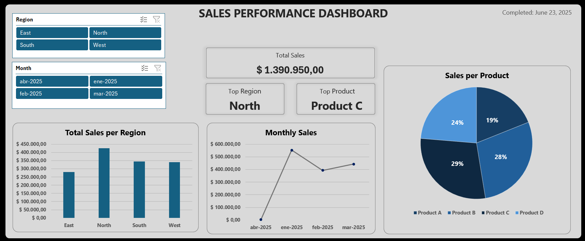

# Sales Performance Dashboard – Monthly Summary

## 🎯 Objective
Practice project to apply key Excel concepts learned during daily exercises, based on a guided mini project.

## 📊 Description
This dashboard presents a monthly summary of sales using fictional data, applying the following techniques:

- Data cleaning and formatting (dates, currency, and data validation)
- Use of structured tables for efficient data handling
- Creation of PivotTables to analyze sales by region, monthly trends, and by product
- Insertion of PivotCharts (column, line, and pie charts)
- Use of slicers and a timeline to filter data interactively
- Design of a clean and functional dashboard layout with KPIs and visuals

## 📸 Preview

## 📚 Source / Reference
Project based on the practice challenge, original link: [link to resource](https://www.linkedin.com/feed/update/urn:li:activity:7341738985959944193?utm_source=share&utm_medium=member_desktop&rcm=ACoAAFCFlkgB63vjQLFp7zHipAmDheZk9MWQraA)

## 📁 Files Included
- Excel file with data, PivotTables, charts, and the final dashboard

## 🧠 Skills Practiced
- Advanced use of PivotTables and PivotCharts in Excel
- Data validation and data cleaning techniques
- Dashboard design and layout in Excel
